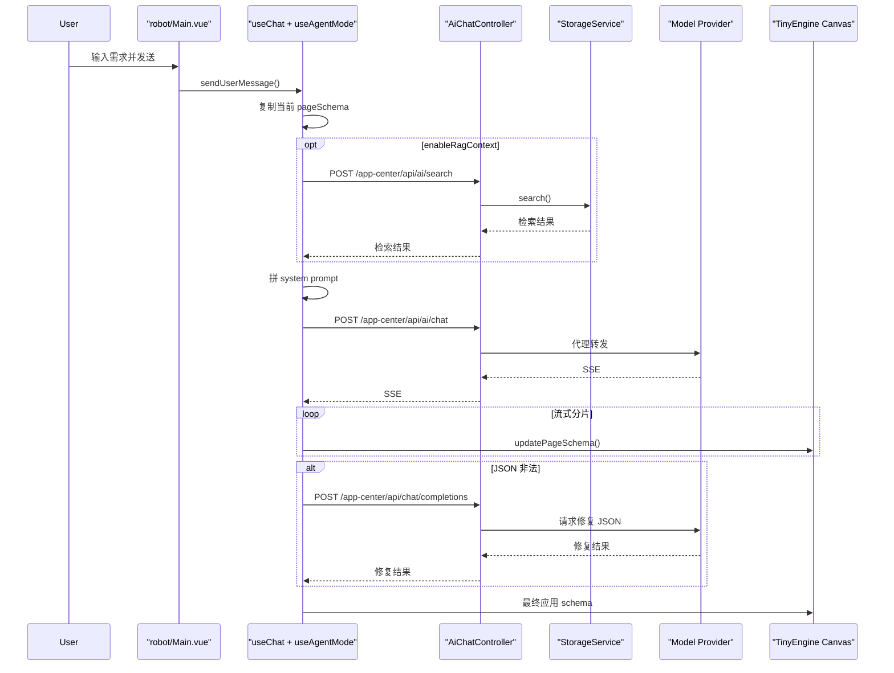
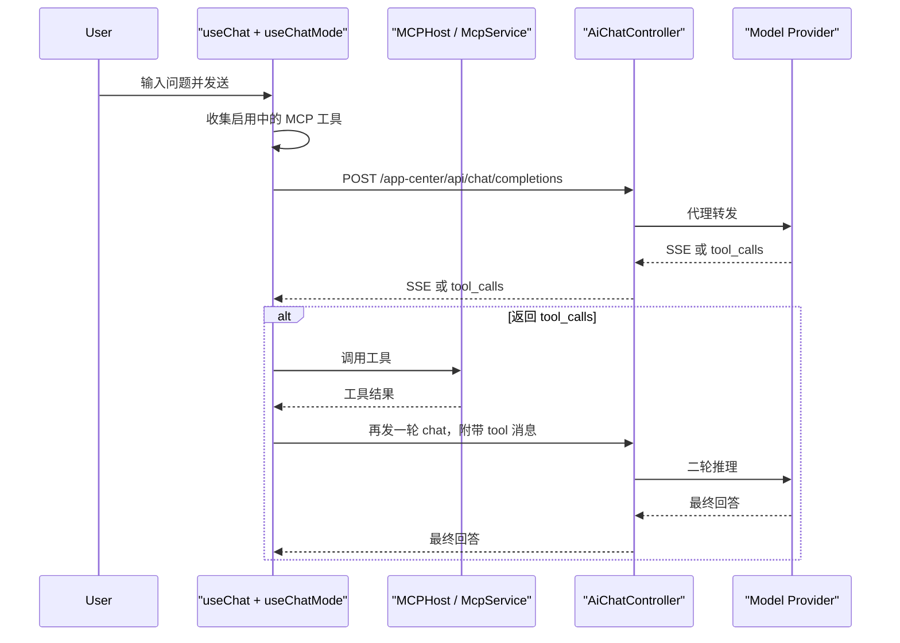

# AI 插件实现总览（前后端）

本文面向开发者，梳理 TinyEngine 新版 AI 插件的实际实现方式，包括：

- 前端插件如何注册、渲染和组织状态
- Agent / Chat 两种模式分别如何工作
- MCP 工具调用链如何接入
- 后端如何做代理、做 API Key 加解密、做 RAG 检索
- 一次完整请求从用户输入到页面更新的链路

本文对应代码：

- 前端插件：`packages/plugins/robot/`
- 使用文档：`docs/advanced-features/new-ai-plugin-usage.md`
- 后端仓库：`D:\myspace\tiny-engine-backend-java`

## 1. 先说结论

这套 AI 插件的主链路不是“前端直接请求第三方模型”，而是：

1. 前端插件统一构造 OpenAI-compatible 请求
2. 请求先发到 TinyEngine 后端的 `app-center/api/*`
3. 后端再把请求代理转发到真实模型服务
4. Agent 模式在前端消费流式结果并实时更新画布
5. Chat 模式在前端消费流式结果并按需执行 MCP 工具

文档里的 Vite `proxy` 配置只是本地调试时的可选方案，不是当前主实现链路。

## 2. 目录与角色

### 2.1 前端核心目录

- `packages/plugins/robot/index.ts`
  - 插件入口，导出 `entry` 和 `metas`
- `packages/plugins/robot/meta.js`
  - 插件元数据和扩展选项入口
- `packages/plugins/robot/src/Main.vue`
  - AI 面板 UI 容器
- `packages/plugins/robot/src/composables/useChat.ts`
  - 统一的聊天发送、流式处理、工具调用和会话管理总入口
- `packages/plugins/robot/src/composables/modes/useAgentMode.ts`
  - Agent 模式实现
- `packages/plugins/robot/src/composables/modes/useChatMode.ts`
  - Chat 模式实现
- `packages/plugins/robot/src/composables/features/useMcp.ts`
  - MCP Server 与工具管理
- `packages/plugins/robot/src/composables/core/useConfig.ts`
  - 模型服务配置、本地持久化、API Key 加密逻辑
- `packages/plugins/robot/src/services/OpenAICompatibleProvider.ts`
  - OpenAI-compatible provider 封装
- `packages/plugins/robot/src/services/api.ts`
  - 对 TinyEngine 后端接口的调用封装

### 2.2 后端核心目录

- `base/src/main/java/com/tinyengine/it/controller/AiChatController.java`
  - AI 相关接口入口
- `base/src/main/java/com/tinyengine/it/service/app/impl/v1/AiChatV1ServiceImpl.java`
  - 新版 AI 代理主实现
- `base/src/main/java/com/tinyengine/it/model/dto/ChatRequest.java`
  - 前端请求 DTO
- `base/src/main/java/com/tinyengine/it/config/OpenAIConfig.java`
  - 代理默认配置和允许访问的 host 配置
- `base/src/main/java/com/tinyengine/it/rag/service/StorageService.java`
  - RAG 向量检索与知识库管理
- `base/src/main/java/com/tinyengine/it/rag/config/VectorStoreConfig.java`
  - ONNX embedding model 与 Chroma store 初始化
- `base/src/main/java/com/tinyengine/it/rag/config/RAGConfig.java`
  - RAG 配置

## 3. 插件是如何挂到 TinyEngine 上的

插件入口在 `packages/plugins/robot/index.ts`：

- `entry` 指向 `src/Main.vue`
- `metas` 挂载 `RobotService`

插件元数据定义在 `packages/plugins/robot/meta.js`，插件 id 是：

- `engine.toolbars.robot`

它声明在工具栏位置，并提供一组可扩展的 `options`：

- `customCompatibleAIModels`
  - 自定义或覆盖默认模型服务配置
- `enableResourceContext`
  - 是否把平台资源图片描述拼进 Agent 提示词
- `enableRagContext`
  - 是否把知识库检索结果拼进 Agent 提示词
- `encryptServiceApiKey`
  - 是否在前端保存前先调后端加密 API Key
- `modeImplementation`
  - 可替换默认 `agent/chat` 两种模式实现
- `mcpConfig`
  - 可注入自定义 MCP Server

这也是文档 `new-ai-plugin-usage.md` 中扩展配置的真实落点。

## 4. 前端整体架构

### 4.1 UI 层

`src/Main.vue` 负责：

- 渲染工具栏按钮
- 打开对话面板
- 维护全屏/设置面板显示
- 接入会话历史
- 提供模式切换
- 提供 MCP 面板入口
- 提供图片上传入口

`Main.vue` 本身不直接关心“如何请求模型”，它只调用 `useChat()` 暴露出来的能力：

- `sendUserMessage`
- `abortRequest`
- `changeChatMode`
- `createConversation`
- `switchConversation`

### 4.2 配置与持久化层

`src/composables/core/useConfig.ts` 负责模型服务配置管理：

- 默认模型定义来自 `src/constants/model-config.ts`
- 用户修改后的配置保存在 `localStorage`
- key 为 `tiny-engine-robot-settings`

配置里包括：

- 当前默认模型
- 快速模型
- 所有模型服务
- 当前聊天模式
- 是否开启深度思考

如果开启 `encryptServiceApiKey`，前端不会直接存明文 API Key，而是：

1. 调后端 `/app-center/api/encrypt-key`
2. 拿到 `EKEY_...`
3. 再保存到本地

### 4.3 Provider 层

`src/services/OpenAICompatibleProvider.ts` 是模型 provider 适配层。

它的职责是：

- 统一组装 OpenAI-compatible request body
- 统一附加 `Authorization: Bearer <apiKey>`
- 支持普通请求和流式请求
- 支持 `fetch` 或 `axios`
- 支持在发请求前通过 `beforeRequest` 注入额外字段

这里有一个关键点：

- 前端并不是直接依赖某一个具体模型 SDK
- 它统一按 OpenAI-compatible 格式构造请求
- 模型差异通过“模型 capability + extraBody”消化

例如在 `model-config.ts` 中，不同模型可以声明：

- `toolCalling`
- `vision`
- `compact`
- `reasoning.extraBody`
- `jsonOutput.extraBody`

这意味着：

- 切模型时，核心代码不用改
- 只是 `beforeRequest` 阶段自动拼不同字段

## 5. 模式分层：Agent 与 Chat

`src/composables/modes/useMode.ts` 是模式调度器。

默认模式注册表只有两个：

- `agent -> useAgentMode`
- `chat -> useChatMode`

但它支持从 `meta.js` 的 `modeImplementation` 覆盖默认实现，因此这是一个正式设计过的扩展点。

## 6. Agent 模式实现

### 6.1 目标

Agent 模式不是单纯聊天，它的目标是：

- 基于当前画布和组件能力生成或修改页面
- 让模型输出 JSON Patch
- 边流式返回边驱动画布更新

### 6.2 请求前做了什么

`useAgentMode.ts` 的 `onBeforeRequest()` 会做几件事：

1. 拿当前页面 schema 副本
2. 如果开启 `enableRagContext`，先调 `/app-center/api/ai/search`
3. 如果开启 `enableResourceContext`，先查资源中心里的图片资源
4. 获取当前物料组件清单
5. 把以上内容拼成一个 system prompt
6. 注入 `model` 和 `baseUrl`
7. 根据模型 capability 自动注入思考参数和 JSON 输出参数

所以 Agent 模式的上下文不只是用户一句话，而是：

- 当前页面 schema
- 当前可用组件清单
- 可选的知识库检索结果
- 可选的平台资源图片描述

### 6.3 为什么能实时更新画布

Agent 模式流式返回时，`onStreamData()` 会持续调用：

- `updatePageSchema(content, pageSchema)`

因此模型返回的内容不是等全部结束后再统一处理，而是边收到边尝试驱动画布更新。

补充说明：

- 这里不是直接用流式内容整份替换当前页面 schema。
- `updatePageSchema()` 内部会先从流式文本中提取 JSON 内容，再结合 `jsonrepair`、JSON Patch 合法性校验和自动修复逻辑尝试生成可应用的 patch。
- patch 应用到 schema 后，还会做一次方法和节点结构修正，再通过 `useCanvas().importSchema()` 落到当前画布。
- 这条更新链路本身经过了节流处理，因此页面更新是“持续渐进式刷新”，不是每个字符都立即触发整页重算。
- 最终请求完成并确认使用最终 patch 后，才会追加历史记录，避免把中间态全部写进撤销栈。

### 6.4 JSON 修复机制

Agent 模式有一个非常关键的兜底：

- 如果模型最终返回的 JSON Patch 不是合法 JSON
- 前端会再发起一次 `/app-center/api/chat/completions`
- 用“修复 JSON 的提示词”要求模型把结果修正

这说明当前实现默认接受一个现实前提：

- 即使提示词已经要求输出 JSON，模型仍然可能输出不合法结果

修复成功后，前端再继续应用 schema。

### 6.5 Agent 模式的典型前端请求

一个简化后的请求结构如下：

```json
{
  "model": "deepseek-chat",
  "baseUrl": "https://api.deepseek.com/v1",
  "messages": [
    {
      "role": "system",
      "content": "包含组件清单、当前 schema、RAG 片段、资源描述的系统提示词"
    },
    {
      "role": "user",
      "content": "生成一个满意度调查表单页面"
    }
  ],
  "stream": true,
  "response_format": {
    "type": "json_object"
  }
}
```

注意：

- RAG 和资源上下文不是独立字段
- 它们被拼进 `messages[0].content`

## 7. Chat 模式实现

### 7.1 目标

Chat 模式主要用于：

- 普通问答
- 代码/文档生成
- 结合 MCP 工具完成平台操作

它不负责实时改页面 schema。

### 7.2 和 Agent 模式的核心区别

Chat 模式的 `onBeforeRequest()` 主要做三件事：

1. 获取启用中的 MCP 工具
2. 转换成 OpenAI-compatible `tools` 格式
3. 注入 `model` / `baseUrl` / reasoning 参数

它不会像 Agent 模式那样拼页面 schema、资源和 RAG 上下文。

### 7.3 工具调用是前端执行的

当前工具调用链不是“模型 -> 后端 -> MCP -> 后端 -> 模型”，而是：

1. 模型返回 `tool_calls`
2. 前端读取 `tool_calls`
3. 前端调用 MCP 客户端执行工具
4. 前端把工具结果作为 `tool` 消息继续发给模型

这段逻辑主要在：

- `src/composables/features/useToolCalls.ts`
- `src/composables/features/useMcp.ts`

补充说明：

- Chat 模式并不是一进入就一定会把 `tools` 带给模型。
- 只有“当前模型声明支持 `toolCalling`”并且“当前至少存在一个已启用的 MCP 工具”这两个条件同时满足时，前端才会把 `tools` 注入本次请求。
- 因此 Chat 模式是否真的进入工具调用链，既受当前会话配置影响，也受当前模型能力约束。

## 8. MCP 工具接入方式

### 8.1 内置 MCP

`useMcp.ts` 默认内置一个 server：

- `tiny-engine-mcp-server`

它实际接到 TinyEngine 自己的 `META_SERVICE.McpService`。

也就是说，TinyEngine 设计器自身暴露的 MCP 能力，会被这个 AI 插件复用。

### 8.2 自定义 MCP

`meta.js` 里的 `mcpConfig.mcpServers` 支持再挂额外 MCP Server。

每个自定义 server 支持：

- `type`
  - `SSE` 或 `StreamableHttp`
- `url`
- `name`
- `description`
- `icon`

前端会把启用的工具统一转换成 OpenAI-compatible tool schema，再放进聊天请求。

## 9. 后端接口设计

后端入口在 `AiChatController.java`，核心接口有四个：

- `POST /app-center/api/ai/chat`
  - Agent 模式使用
- `POST /app-center/api/chat/completions`
  - Chat 模式使用，也被 Agent 模式拿来做 JSON 修复
- `POST /app-center/api/encrypt-key`
  - API Key 加密
- `POST /app-center/api/ai/search`
  - RAG 检索

这四个接口基本覆盖了前端插件的主能力。

## 10. 后端代理实现

### 10.1 真实核心实现

新版主链路的真实实现是：

- `AiChatController`
- `AiChatV1ServiceImpl`

不是旧的 `AiChatClient` 那一套。

另外要注意，前端看起来有两个聊天入口：

- `POST /app-center/api/ai/chat`
- `POST /app-center/api/chat/completions`

但这两个接口在后端最终都会进入同一个 `AiChatV1ServiceImpl.chatCompletion()`。也就是说，后端没有单独维护两套 Agent / Chat 聊天核心实现；真正的模式差异，主要还是由前端在请求构造阶段决定，例如是否注入页面上下文、是否带上 tools、以及返回结果是否用于实时更新画布。

也就是说，如果要排查“为什么前端请求模型异常”，优先看：

- `AiChatV1ServiceImpl.java`

不要先去看旧的 `AiChatClient.java`。

### 10.2 后端收到了什么

后端接收的是 `ChatRequest`：

- `model`
- `apiKey`
- `baseUrl`
- `messages`
- `tools`
- `stream`
- `response_format`
- `enable_thinking`
- `tool_choice`
- `parallel_tool_calls`
- 其他 OpenAI-compatible 字段

所以后端对 Agent 和 Chat 的认知并不强，它看到的本质都是：

- 一个 OpenAI-compatible 的聊天请求

模式差异主要由前端在请求阶段就完成了。

### 10.3 后端如何转发

`AiChatV1ServiceImpl` 的逻辑是：

1. 读取 `ChatRequest`
2. 构造标准 JSON body
3. 取出 API Key
4. 如果是 `EKEY_...`，先解密
5. 规范化 `baseUrl`
6. 校验目标 host 是否允许访问
7. 发 HTTP 请求到真实模型服务
8. 普通请求返回 JSON
9. 流式请求原样透传 SSE

### 10.4 baseUrl 规范化规则

后端支持几种输入：

- 已经是 `/chat/completions`
  - 直接使用
- 只配到 `/v1`
  - 自动补 `/chat/completions`
- 结尾是 `#`
  - 强制按原地址使用
- 没写协议
  - 自动补 `https://`

这和前端设置面板里关于 Base URL 的说明是一致的。

### 10.5 安全校验

后端代理不是无条件转发，它会校验：

- host 是否在 `ai.allowedHosts` 中
- 如果允许任意 host，是否满足 HTTPS
- 是否解析到内网地址

这层逻辑主要用于避免把后端代理变成任意 SSRF 跳板。

## 11. API Key 加密机制

前端如果开启 `encryptServiceApiKey`：

1. 用户在设置面板输入明文 API Key
2. 前端调用 `/app-center/api/encrypt-key`
3. 后端使用 `SM4` 加密
4. 返回 `EKEY_...`
5. 前端把 `EKEY_...` 存到本地
6. 后续请求仍然把这个值放进 `Authorization: Bearer ...`
7. 后端收到后再解密成真实 API Key

这里有一个实现细节：

- `Authorization` 头里放的不是平台登录 token
- 而是模型服务 API Key 或其加密值

这一点在排查鉴权问题时很重要。

## 12. RAG 实现

### 12.1 前端如何用 RAG

前端只有在 Agent 模式、并且开启 `enableRagContext` 时，才会调：

- `POST /app-center/api/ai/search`

返回结果会被截断并拼进 system prompt。

前端本身不维护向量库，它只消费检索结果。

这里的 `/app-center/api/ai/search` 只是检索入口，不负责把文档写入知识库。如果当前向量库还没有内容，或者指定 collection 下没有命中文档，那么 `enableRagContext` 最终只会得到空的检索结果，前端仍然会继续发起聊天请求，只是不会获得额外的知识库上下文。

### 12.2 后端如何做 RAG

后端 RAG 由 `StorageService` 负责：

- 加载文档
- 解析文档
- 切分文档
- 生成 embedding
- 写入向量库
- 执行相似度检索

支持的集合名当前主要有：

- `tinyengine_documents`
- `agent_documents`

不过“能检索”不等于“已经有库可查”。知识库内容需要通过 `VectorStorageController` 预先写入，当前代码里可以看到几类入口：

- `POST /app-center/api/vector-storage/create`
- `POST /app-center/api/vector-storage/collection/{collection}`
- `GET /app-center/api/vector-storage/auto`

可以把它理解成两条独立链路：

- 一条是建库 / 灌库链路，负责把文档切分、embedding 并写入向量库
- 一条是查询链路，负责根据用户问题从已有向量库中检索片段

因此要让 `enableRagContext` 真正生效，除了前端打开该能力，还需要后端已经完成对应文档的入库。

### 12.3 向量库和 embedding model

`VectorStoreConfig` 会初始化：

- ONNX embedding model
- Chroma embedding store

默认依赖的环境变量来自 `RAGConfig`：

- `CHROMA_BASE_URL`
- `MODEL_PATH`
- `TOKENIZER_PATH`

在 `docker-compose.yml` 中也能看到对应容器：

- `tiny-engine-rag`
  - ChromaDB
- `tiny-engine-back`
  - 后端服务，依赖 Chroma

### 12.4 失败降级

如果：

- ONNX 模型没配置好
- Chroma 连不上

后端不会直接起不来，而是回退到 fallback 实现。

这意味着：

- 服务仍能启动
- 但 RAG 实际不可用或能力受限

这是一个“可用性优先”的设计。

## 13. 资源上下文实现

当 `enableResourceContext !== false` 时，Agent 模式还会：

1. 读取当前应用 id
2. 调资源接口拿资源组和资源项
3. 只取有 `description` 的资源
4. 映射成 `{ url, describe }`
5. 拼进 system prompt

这个设计的目标是：

- 让模型在生成页面时优先复用平台已有图片资源
- 而不是凭空想象外部图片地址

### 13.1 用户上传图片参与本次请求

除了“读取平台已有资源作为上下文”，插件还支持用户在当前会话里主动上传图片，把图片作为本次请求的多模态输入。

这条链路和资源上下文不是一回事，它的实际过程是：

1. 用户在聊天面板选择本地图片
2. 前端先把图片上传到 `material-center/api/resource/upload`
3. 上传成功后拿到资源 URL
4. 发送消息时，不是把本地文件二进制直接塞给模型，而是把这个 URL 组装进 `user` 消息

最终发送给模型的 `user` 消息内容会是多模态数组，至少包含两部分：

- `image_url`
- `text`

也就是说，“平台已有资源作为上下文”和“用户主动上传图片参与当前请求”是两条不同链路：

- 前者用于补充 system prompt，让模型知道平台里有哪些可参考资源
- 后者用于当前这次用户消息本身，让模型同时看到图片和文字输入

## 14. 一次完整请求的真实链路

### 14.1 Agent 模式



### 14.2 Chat 模式



## 15. 文档中的“代理配置”该怎么理解

`new-ai-plugin-usage.md` 里的 Vite `proxy` 示例：

- 可以用于本地开发调试
- 可以把 `/app-center/api/chat/completions` 之类的地址改写到第三方模型

但从当前代码看，正式设计意图仍然是：

- 前端打 TinyEngine 后端接口
- 后端统一做代理、安全校验和加解密

因此排查线上问题时，优先按后端代理链理解，不要按本地 Vite 代理链理解。

## 16. 主要扩展点

如果你要二次开发，这几个点最重要：

### 16.1 替换模式实现

通过 `meta.js -> options.modeImplementation` 可替换：

- `chat`
- `agent`

适合做：

- 自定义 Agent 提示词策略
- 自定义后处理逻辑
- 自定义页面更新逻辑

### 16.2 覆盖模型服务

通过 `customCompatibleAIModels` 可：

- 删除默认 provider
- 覆盖已有 provider 配置
- 追加新的 OpenAI-compatible 服务
- 给模型声明不同能力

### 16.3 注入自定义 MCP Server

通过 `mcpConfig.mcpServers` 可接入外部 MCP 服务。

### 16.4 打开或关闭上下文增强

通过：

- `enableRagContext`
- `enableResourceContext`

控制 Agent 模式是否带知识库内容和平台图片资源。

## 17. 开发时最容易误判的点

### 17.1 不要把旧实现和新实现混在一起

后端仓库里仍有旧的 `AiChatClient` / `AiChatConfig`，但新插件主链路走的是：

- `AiChatController`
- `AiChatV1ServiceImpl`

### 17.2 不要把“模型 API Key”误当成“平台登录 token”

这里的 `Authorization` 主要承载模型服务的 API Key。

### 17.3 RAG 不是后端自动参与每次对话

RAG 只有在前端 Agent 模式显式开启 `enableRagContext` 时才会先查，再拼进 prompt。

### 17.4 资源上下文不是单独字段

资源列表会被拼成提示词文本，不是作为专门的 JSON 字段传给模型。

### 17.5 Agent 和 Chat 的差异主要在前端

后端看到的两类请求最终都被整理成 OpenAI-compatible `ChatRequest`，真正的模式语义大部分由前端完成。

## 18. 总结

这套 AI 插件可以概括为：

- 前端做模式编排、上下文组装、工具执行和页面更新
- 后端做模型代理、API Key 加解密、URL 安全校验和 RAG 检索
- Agent 模式面向“改页面”
- Chat 模式面向“问答 + MCP 工具”

如果要继续深入，推荐按下面顺序读代码：

1. `packages/plugins/robot/src/Main.vue`
2. `packages/plugins/robot/src/composables/useChat.ts`
3. `packages/plugins/robot/src/composables/modes/useAgentMode.ts`
4. `packages/plugins/robot/src/composables/modes/useChatMode.ts`
5. `packages/plugins/robot/src/composables/features/useMcp.ts`
6. `D:\myspace\tiny-engine-backend-java\base\src\main\java\com\tinyengine\it\controller\AiChatController.java`
7. `D:\myspace\tiny-engine-backend-java\base\src\main\java\com\tinyengine\it\service\app\impl\v1\AiChatV1ServiceImpl.java`
8. `D:\myspace\tiny-engine-backend-java\base\src\main\java\com\tinyengine\it\rag\service\StorageService.java`

读完这几处，基本就能把整套插件链路串起来。
