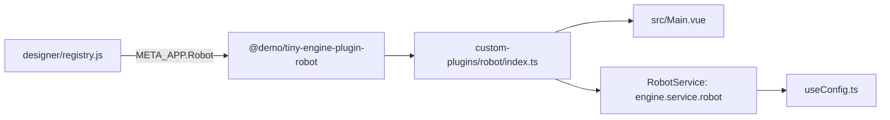
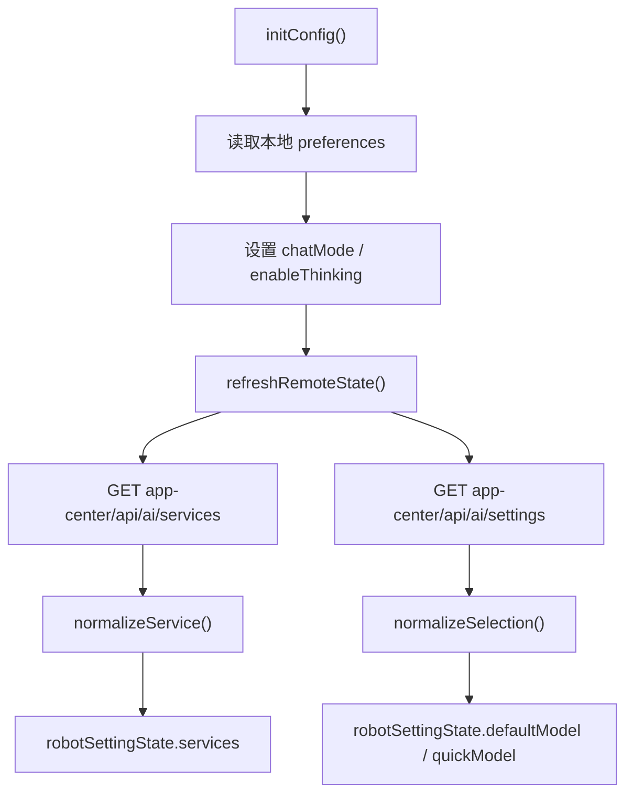
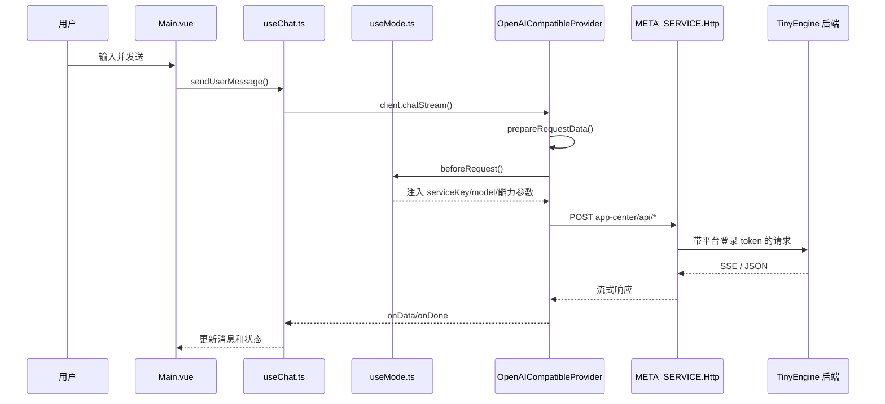

# Robot 插件当前流程说明

本文按 `D:\myspace\tiny-engine-platform-demo` 当前代码梳理 `custom-plugins/robot` 的主流程，重点说明模型服务配置后端化之后，插件和旧实现的差异。

## 1. 先看结论

当前 `robot` 插件的核心变化是：模型服务定义、默认模型、快速模型不再由前端本地常量和 localStorage 作为主数据源，而是从后端接口读取。

当前链路可以概括为：

1. `designer/registry.js` 把本地插件注册到 `META_APP.Robot`。
2. `custom-plugins/robot/src/metas/index.ts` 注册 `engine.service.robot`，初始化时调用 `useConfig.ts`。
3. `useConfig.ts` 调后端读取模型服务和用户设置。
4. UI 根据后端返回的 `services/defaultModel/quickModel` 渲染设置页和能力开关。
5. 发送聊天请求时，前端只把 `serviceKey + model` 放进请求体。
6. 后端根据 `serviceKey` 解析真实模型服务配置、Base URL 和 API Key。

需要特别区分两种 `Authorization`：

- 模型服务 API Key：当前主流程不再由前端放到 `Authorization: Bearer <apiKey>`。
- 平台登录 token：仍由 `designer/src/composable/http/index.js` 的 HTTP 拦截器附加到请求头，用于 TinyEngine 后端登录鉴权。

## 2. 插件如何挂到设计器

入口文件：

- `designer/registry.js`
- `custom-plugins/robot/index.ts`
- `custom-plugins/robot/meta.js`
- `custom-plugins/robot/src/metas/index.ts`
- `custom-plugins/robot/src/Main.vue`

挂载关系：



关键点：

- `designer/registry.js` 里用 `[META_APP.Robot]: customRobotPlugin` 覆盖内置 Robot 插件。
- `index.ts` 导出插件元信息、入口组件和 `RobotService`。
- `RobotService` 的 `init` 指向 `useConfig.ts` 导出的 `init`，因此插件服务初始化会提前拉配置。
- `Main.vue` 是工具栏按钮和聊天面板容器，真正的聊天逻辑在 `useChat.ts` 和各模式 hook 里。

## 3. 配置来源的新旧差异

旧链路里，前端会把默认模型服务常量、插件 `meta.js` 扩展配置、用户本地配置合并在一起。当前主流程已经改为后端源。

| 项目 | 旧理解 | 当前代码 |
| --- | --- | --- |
| 模型服务列表 | 前端 `DEFAULT_LLM_MODELS` / `customCompatibleAIModels` | `GET app-center/api/ai/services` |
| 默认模型 | localStorage | `GET/POST app-center/api/ai/settings` |
| 快速模型 | localStorage | `GET/POST app-center/api/ai/settings` |
| 聊天模式 `chatMode` | localStorage | 仍在前端 localStorage |
| 深度思考 `enableThinking` | localStorage | 仍在前端 localStorage |
| 模型 API Key | 前端配置后发请求头 | 设置页提交给后端，聊天时只传 `serviceKey` |
| 服务主标识 | `provider/baseUrl` 等 | `serviceKey` |

当前本地偏好 key 是：

```txt
tiny-engine-robot-preferences
```

它只保存：

- `chatMode`
- `enableThinking`

`custom-plugins/robot/src/constants/model-config.ts` 仍然存在，并且 `constants/index.ts` 仍导出它，但当前 `useConfig.ts` 没有再导入它作为模型服务主数据源。理解当前流程时，应以 `apiService.getAIServices()` 和 `apiService.getAISettings()` 为准。

## 4. useConfig.ts 做了什么

核心文件：

- `custom-plugins/robot/src/composables/core/useConfig.ts`
- `custom-plugins/robot/src/services/api.ts`
- `custom-plugins/robot/src/types/setting.types.ts`

初始化流程：



`robotSettingState` 当前包含：

- `services`：后端返回的模型服务列表。
- `defaultModel`：默认助手模型，结构是 `{ serviceKey, modelName }`。
- `quickModel`：快速模型，结构也是 `{ serviceKey, modelName }`。
- `chatMode`：当前模式，默认 `agent`。
- `enableThinking`：是否开启深度思考。

后端服务 DTO 前端关心这些字段：

- `id`
- `serviceKey`
- `provider`
- `label`
- `baseUrl`
- `hasApiKey`
- `allowEmptyApiKey`
- `scopeType`
- `editable`
- `enabled`
- `deprecated`
- `isBuiltIn`
- `models`

模型 `models[]` 里主要看：

- `name`
- `label`
- `capabilities.toolCalling`
- `capabilities.vision`
- `capabilities.compact`
- `capabilities.reasoning.extraBody`
- `capabilities.jsonOutput.extraBody`

选择兜底逻辑：

- `defaultModel` 无效时，会优先从可用的内置服务里选第一个模型。
- `quickModel` 要求模型有 `capabilities.compact`；如果后端返回为空，允许保持空。
- 服务必须满足 `enabled !== false`、`deprecated === false`、且有模型列表，才会进入可选集合。

## 5. 设置页流程

核心文件：

- `custom-plugins/robot/src/components/header-extension/robot-setting/RobotSetting.vue`
- `custom-plugins/robot/src/components/header-extension/robot-setting/ServiceEditDialog.vue`

设置页有两个 tab：

| Tab | 数据来源 | 保存动作 |
| --- | --- | --- |
| 模型选择 | `robotSettingState.services/defaultModel/quickModel` | `saveUserSettings()` -> `POST app-center/api/ai/settings` |
| 模型服务 | `robotSettingState.services` | 新增、更新、删除服务 -> `app-center/api/ai/services` |

服务管理规则在前端也做了基本约束：

- 内置服务 `isBuiltIn = true` 不显示编辑、删除按钮。
- 自定义服务可以新增、编辑、删除。
- 新增和编辑服务会提交 `provider/label/baseUrl/apiKey/allowEmptyApiKey/models`。
- 后端不应返回明文 `apiKey`，前端只通过 `hasApiKey` 展示是否已配置。
- 编辑已有服务时，`apiKey` 不填表示保留；填空字符串表示清空；填非空表示替换。

设置默认模型时，如果目标服务没有 API Key 且不允许空 key，前端会提示并切到“模型服务”tab。

## 6. 聊天发送总流程

核心文件：

- `custom-plugins/robot/src/Main.vue`
- `custom-plugins/robot/src/composables/useChat.ts`
- `custom-plugins/robot/src/composables/modes/useMode.ts`
- `custom-plugins/robot/src/composables/modes/useChatMode.ts`
- `custom-plugins/robot/src/composables/modes/useAgentMode.ts`
- `custom-plugins/robot/src/services/aiClient.ts`
- `custom-plugins/robot/src/services/OpenAICompatibleProvider.ts`

发送链路：



`useChat.ts` 负责：

- 初始化 `AIClient`。
- 根据当前模式设置 `apiUrl`。
- 添加 loading 消息。
- 管理 abort controller。
- 处理流式响应、结束原因和错误。
- 处理 tool call 二段请求。
- 管理会话列表、切换、标题。

`OpenAICompatibleProvider.ts` 负责：

- 把消息转成 OpenAI-compatible 请求体。
- 调用 `beforeRequest` 让模式 hook 注入字段。
- 处理普通响应和 SSE 流式响应。
- 兼容没有 `[DONE]` 的流式结束。
- 把非标准 `<think>...</think>` 拆成 `reasoning_content`，供深度思考 UI 渲染。

注意：`OpenAICompatibleProvider` 类里仍保留 `apiKey` 和 `Authorization` 组装能力，但当前 `initChatClient()` 没有把模型服务 API Key 写入 provider 配置。因此当前主流程不会把模型服务密钥作为前端请求头发出去。

## 7. Agent 和 Chat 两种模式

模式调度入口是 `useMode.ts`：

```txt
agent -> useAgentMode.ts
chat  -> useChatMode.ts
```

当前模式来自 `getSelectedModelInfo().config.chatMode`，也就是 `useConfig.ts` 里保存的本地偏好。

### 7.1 Chat 模式

`useChatMode.ts` 的请求地址：

```txt
app-center/api/chat/completions
```

请求前会做：

1. 读取当前默认模型 `getSelectedModelInfo()`。
2. 注入 `requestParams.serviceKey`。
3. 注入 `requestParams.model`。
4. 如果 MCP 工具已启用，且模型没有显式禁用 `toolCalling`，注入 `tools`。
5. 如果模型声明了 `reasoning.extraBody`，根据 `enableThinking` 合并对应请求参数。

Chat 模式主要用于普通问答和 MCP 工具调用，不会主动更新页面 schema。

### 7.2 Agent 模式

`useAgentMode.ts` 的请求地址：

```txt
app-center/api/ai/chat
```

请求前会做：

1. 复制当前页面 schema。
2. 如果开启 `enableRagContext`，调用 `app-center/api/ai/search` 拉知识库上下文。
3. 如果开启 `enableResourceContext`，从资源中心读取图片资源描述。
4. 读取当前物料组件清单。
5. 拼接 system prompt。
6. 注入 `serviceKey` 和 `model`。
7. 根据 `reasoning.extraBody` 注入深度思考参数。
8. 根据 `jsonOutput.extraBody` 注入 JSON 输出参数。

流式返回时：

- `useMessageStream.ts` 持续拼接 `delta.content`、`reasoning_content`、`tool_calls`。
- Agent 模式的 `onStreamData()` 会调用 `updatePageSchema(content, pageSchema)`。
- `pageUpdater.ts` 尝试从流式文本里提取 JSON Patch，修复并应用到当前页面 schema。
- 最终结束时再做一次 JSON Patch 校验、必要时调用补全请求修复 JSON，然后写入历史。

## 8. 模型能力 capabilities 如何影响前端

`capabilities` 已经变成后端模型配置的一部分，前端只是消费。

| 能力字段 | 当前用途 |
| --- | --- |
| `toolCalling` | Chat 模式下决定是否把 MCP tools 注入请求；`false` 时不注入 |
| `vision` | `Main.vue` 中决定 Agent 模式是否允许上传图片 |
| `compact` | 设置页快速模型下拉只展示 compact 模型 |
| `reasoning.extraBody` | 根据 `enableThinking` 合并 enable/disable 参数 |
| `jsonOutput.extraBody` | Agent 模式要求 JSON Patch 输出时合并参数 |

示例：如果后端返回某模型：

```json
{
  "name": "xxx",
  "label": "XXX",
  "capabilities": {
    "toolCalling": true,
    "compact": true,
    "reasoning": {
      "extraBody": {
        "enable": { "enable_thinking": true },
        "disable": null
      }
    }
  }
}
```

那么前端会：

- 允许它出现在默认模型下拉。
- 允许它出现在快速模型下拉，因为有 `compact`。
- Chat 模式可注入 MCP tools，因为 `toolCalling` 不是 `false`。
- 开启深度思考时，把 `enable_thinking: true` 合并进请求体。

## 9. 快速模型 quickModel 当前状态

当前仓库内，`quickModel` 已经接入了后端读写和设置页展示：

- 读取：`GET app-center/api/ai/settings`
- 保存：`POST app-center/api/ai/settings`
- 下拉来源：`getCompactModels()`
- 导出：`getSelectedQuickModelInfo()`

但当前聊天发送主链路没有直接使用 `getSelectedQuickModelInfo()`。也就是说，普通 Chat / Agent 请求当前仍使用 `defaultModel`。`quickModel` 目前更像是后端配置体系里已经准备好的快速模型设置，供后续补全、标题生成或其他轻量任务接入。

## 10. 和旧文档对照时的注意点

如果看旧的 `docs/ai 插件实现总览.md`，下面几处已经不适合直接套到当前实现：

- `tiny-engine-robot-settings` 不再是模型服务主配置 key。
- `DEFAULT_LLM_MODELS` 不再是模型服务主来源。
- `customCompatibleAIModels` 不再是当前后端化方案的主扩展点。
- 前端不再把模型服务 API Key 作为聊天请求的 `Authorization` 头。
- 当前聊天请求关键字段是 `serviceKey + model`。

更准确的当前理解是：

```txt
后端维护服务和密钥
前端读取可见服务
前端选择 serviceKey/model
前端聊天请求传 serviceKey/model/messages
后端解析 serviceKey 并代理真实模型服务
```

## 11. 排查问题时优先看哪里

| 现象 | 优先检查 |
| --- | --- |
| 模型下拉为空 | `useConfig.ts` 的 `getAIServices()` 返回值、服务是否 `enabled/deprecated/models` 合法 |
| 默认模型不对 | `GET app-center/api/ai/settings` 返回值，以及 `normalizeSelection()` 兜底逻辑 |
| 快速模型不显示 | 模型是否有 `capabilities.compact` |
| 未配置 API Key 提示 | 服务的 `hasApiKey` 和 `allowEmptyApiKey` |
| 聊天 401 / 未登录 | `designer/src/composable/http/index.js` 是否带平台登录 token |
| 后端找不到模型服务 | 请求体是否有 `serviceKey` 和 `model` |
| MCP 工具不生效 | 当前模型 `capabilities.toolCalling` 是否为 `false`，以及 `useMcp.ts` 工具是否启用 |
| Agent 不更新页面 | `useAgentMode.ts`、`useMessageStream.ts`、`pageUpdater.ts` 的 JSON Patch 处理 |
